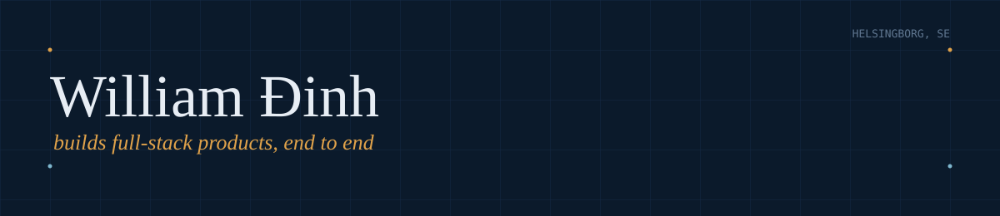

 

I build full-stack products end to end — from database schema to deployed
interface. Currently building [Sista Steget](https://sistasteget.se), a
citizenship-test platform I shipped solo and still update weekly.

## Building now

**[Sista Steget](https://sistasteget.se)** is a multilingual platform that
helps people prepare for the Swedish citizenship test. I built all of it —
auth, payments, and content run through Supabase, Stripe, and Sanity, and a
quiz engine tracks each learner's progress as they go.

## Recent work

**Globy AI** — Software Engineer, 2024–2026
Built an AI-native site editor where you edit a live page by prompting it,
WYSIWYG and prompt-based editing side by side. Added WebSockets so responses
feel conversational rather than a page reload, and put Auth0 SSO behind the
whole product suite.

**Trust Coupon** — Freelance, 2025
Took a coupon-and-discount platform from idea to production: Next.js and
NestJS on a Postgres backend, tuned until the UI felt instant.

**Plejd** — Fullstack Software Engineer, Gothenburg, 2024
Made an established React/Next.js codebase faster through targeted
refactoring, memoization, and code splitting, plus the testing work that
keeps it all standing.

## Stack

## Contact

[william.dinh.dev@gmail.com](mailto:william.dinh.dev@gmail.com) — Helsingborg, Sweden
